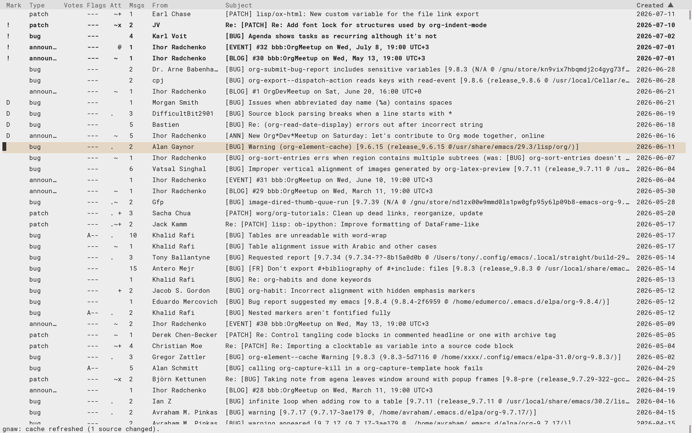

#+title: gnaw.el --- GNAW is Not Another Workflow

: 3==3      <= A gnawed bone.

[[https://www.repostatus.org/#active][https://img.shields.io/badge/status-active-brightgreen.svg?style=for-the-badge]]
[[https://intver.org/][https://img.shields.io/badge/versioning-intver.org-blue.svg?style=for-the-badge]]

=gnaw.el= is an Emacs browser of [[https://codeberg.org/bzg/bone][BONE]] reports and a shared utility for
other mail front-ends like [[https://codeberg.org/bzg/gnus-gnaw][gnus-gnaw]], [[https://codeberg.org/bzg/notmuch-gnaw][notmuch-gnaw]] and [[https://codeberg.org/bzg/mu4e-gnaw][mu4e-gnaw]].

=M-x gnaw= lists reports. It makes it easy to search through them, to
read the associated email and to view/apply patches and attachments.

#+caption: Gnaw summary

* Installation

gnaw.el requires Emacs 28.1 or later.

=gnaw.el= is not on MELPA yet. On Emacs 30 or later, install it straight
from its git repository with the built-in =package-vc=; the =:doc= spec
also builds and installs the Info manual (=C-h i m gnaw RET=):

#+begin_src emacs-lisp
(use-package gnaw
  :init
  (unless (package-installed-p 'gnaw)
    (package-vc-install
     '(gnaw :url "https://codeberg.org/bzg/gnaw.el"
            :doc "doc/gnaw-manual.org"))))
#+end_src

The =:init= form is needed because the =:vc= keyword of =use-package= does
not support =:doc=. Interactively, without the manual:

: M-x package-vc-install RET https://codeberg.org/bzg/gnaw.el RET

Update later with =M-x package-vc-upgrade RET gnaw RET=.

* Getting started

=M-x gnaw= opens the =*gnaw*= report browser. With no source configured,
it runs the full interactive setup, asking for a source URL, one or
more local git repositories where its patches apply, and how to open
report mail; =M-x gnaw-configure= reruns it later on.

In the browser, =h= (or =?=) lists all the key bindings; =/= filters the
list with =key:value= tokens. Each launch displays a tip presenting a
random command; set =gnaw-inhibit-startup-tip= to a non-nil value to
disable it.

* Documentation

The [[file:doc/gnaw-manual.org][Gnaw manual]] covers everything else: the report browser and its
key bindings, the search query language, reading messages, applying
patches, =config.edn=, all the options and the API for front-ends.

Build it as Info or PDF from the top of the repository:

: make info
: make pdf

Building the manual needs Emacs 29 or later (the export relies on
Org 9.6), =makeinfo= for the Info output and =texi2pdf= for the PDF.

* Contributing

- Send a [[mailto:~bzg/boneyard@lists.sr.ht][bug report]] with =[BUG] gnaw.el: <SHORT EXPLICIT BUG DESCRIPTION>=
- Send a [[mailto:~bzg/boneyard@lists.sr.ht][patch]] with =[PATCH] gnaw.el: <COMMIT SUMMARY>=
- Send a [[mailto:~bzg/boneyard@lists.sr.ht][feature request]] with =[FR] gnaw.el: <FEATURE REQUEST>=
- Share any [[mailto:~bzg/boneyard@lists.sr.ht <ANYTHING>][other question or idea]]

You can also [[mailto:bzg@bzg.fr][send me an email]] and support my work on [[https://liberapay.com/bzg/][liberapay]].

* Intentional Versioning

This project uses [[https://intver.org][Intentional Versioning]], with three audiences:

- =x=: end users
- =y=: indirect users, via the front-ends
- =z=: contributors to the codebase

* License

Copyright © 2026 Bastien Guerry

=gnaw.el= is published under the terms of the GNU General Public
License, either version 3 of the License, or (at your option) any
later version.
